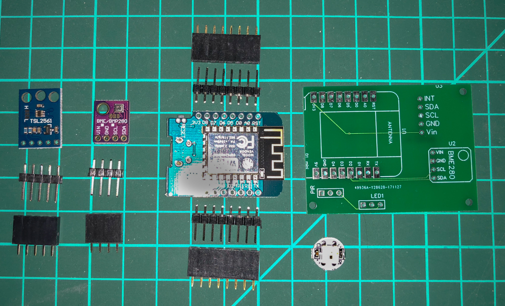
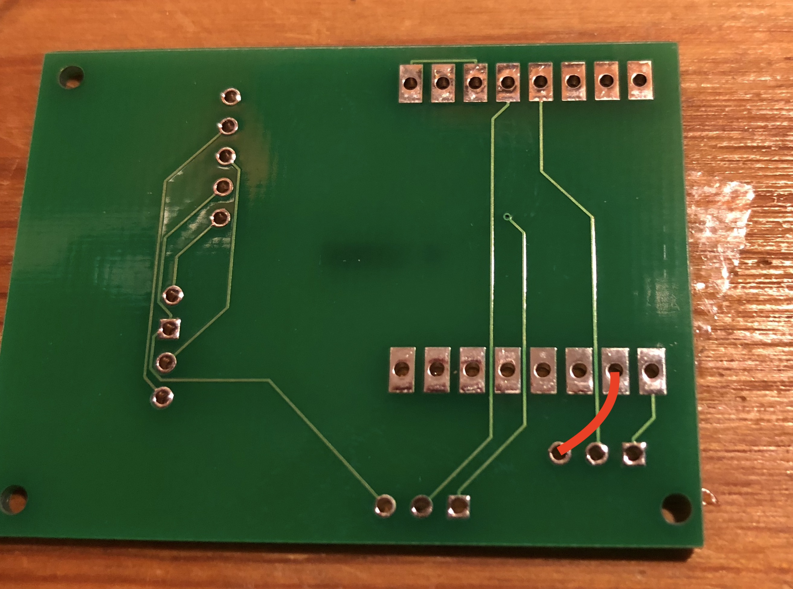
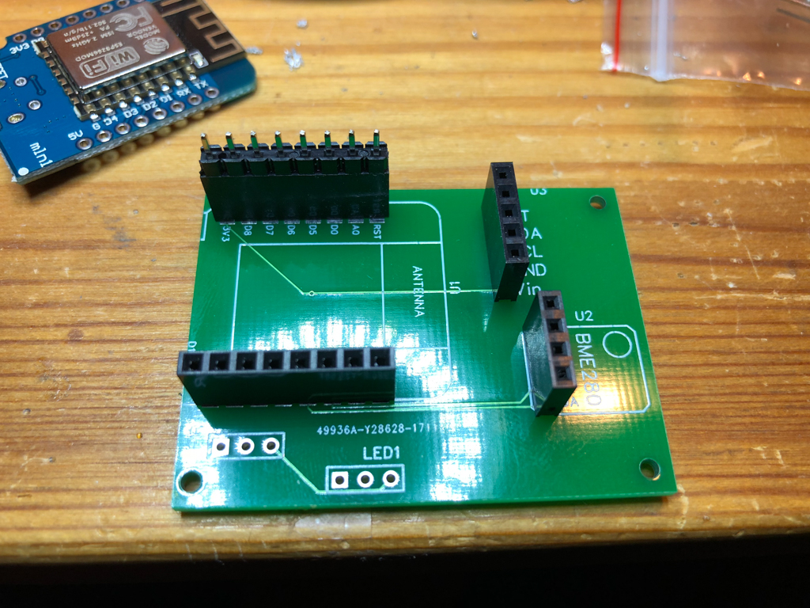
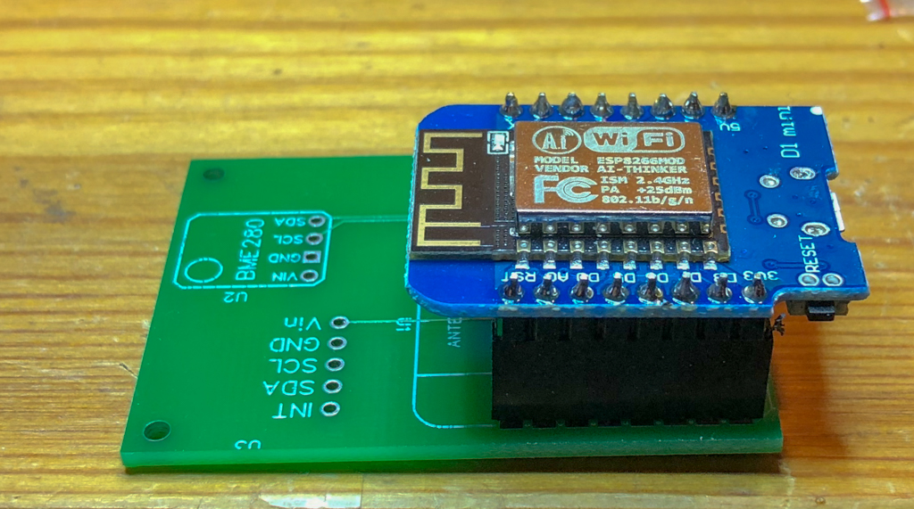
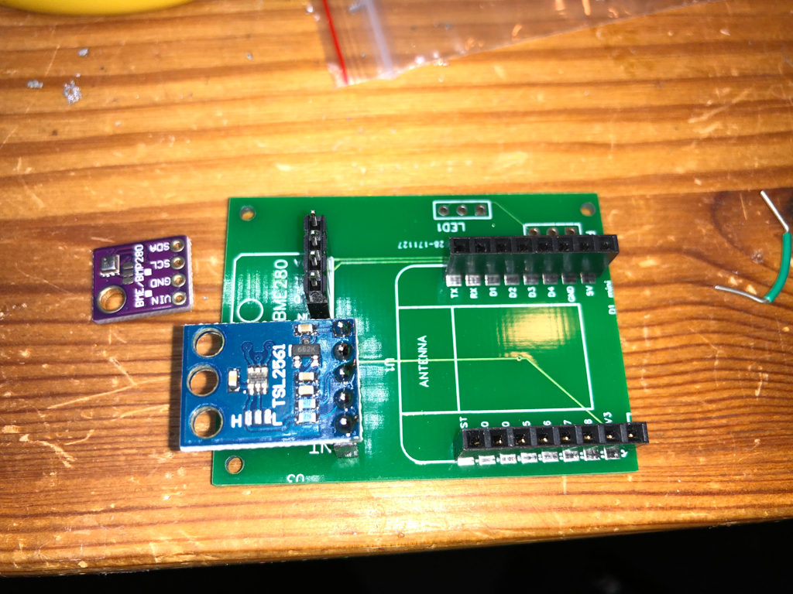
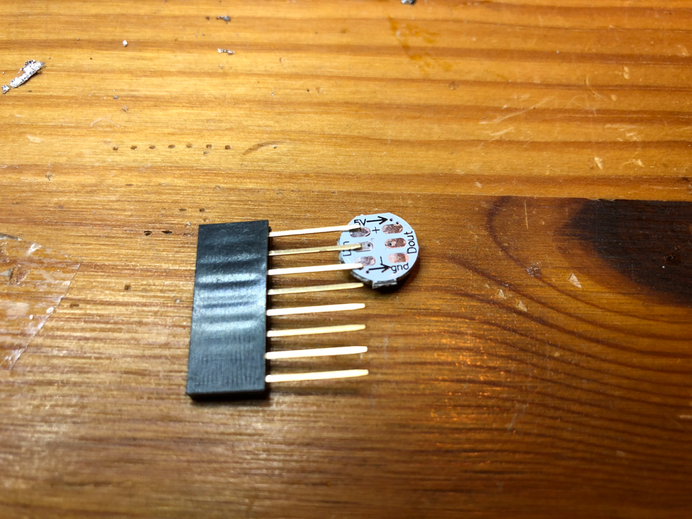
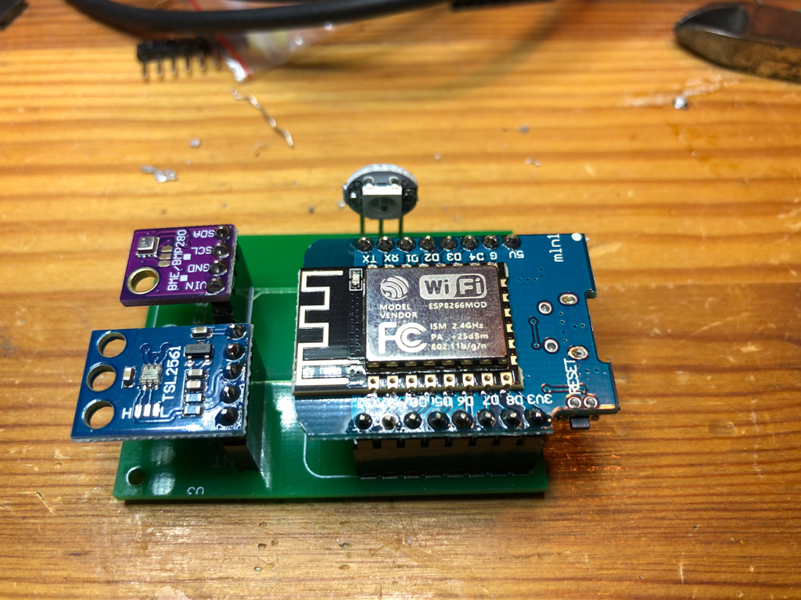

# MQTTClient
ESP8266 MQTT Client for sensor reading

## Parts List Indoor Version
* ESP8266 Microcontroller incl. USB port for easier programming
* BME280 Temperature/Pressure/Humidity Sensor
* TSL2561 Light sensor
* WS2812 RGP LEDs (as many as you need)
* PIR motion sensor (not used in Example)
* See parts photo 

## Parts List Outdoor Version
* ESP8266 Microcontroller incl. USB port for easier programming
* BME280 Temperature/Pressure/Humidity Sensor
* TSL45315 Light sensor
* Solar panel 3-5W (the lower the voltage the better)
* Battery holder for two AA cells
* Two AA Eneloop cells (enough for three cloudy days)
* 3.3V step down converter (depending on solar panel used)
* 3.3V voltage regulator (to prevent battery discharge via the regulator)

# Soldering
PIR is not used in this example. Because I made a mistake with the PCB board, you must solder a wire from the D1mini GND pin to the GND pin of the sensors. 

1. First solder the pin headers 
2. Next plug in the D1mini including the male pin headers and solder the male pin headers to the D1mini from the top 
3. Do the same with the two sensors 
4. Depending on what type of LED you have solder the LED 
5. Finished module 

# Software
## Config files
Create a directory named *data* within your Arduino project directory.
This directory should contain the following files, each file should only contain one string:
* site   
  Name of the site. Like 'MyHouse'.
* location  
  Name of the location within the site. Like 'Kitchen'.
* myname  
  Hostname of the sensor. Like 'sensor3'.
* mqttserver  
  Name of the mqttserver to connect to. Like 'myserver.local' or '192.168.1.5'
* ssid   
  Wifi network name to connect to.
* pass   
  WPA2 password of the wifi network.

Then use the *Tools* -> *ESP8266 Sketch Data Upload* menuitem to upload the files.

Compile the software and also upload it to the sensor. If everything is ok and if you have included a LED the LED color will tell you the status when booting:
* Red: Just booting
* Yellow: Connected to Wifi
* Green: Connected to MQTT server
* Off: up and running

